<!-- Animated Header -->
<p align="center">
  
</p>

<!-- Typing SVG -->
<p align="center">
  <a href="https://git.io/typing-svg">
    
  </a>
</p>

<!-- Social Badges -->
<p align="center">
  <a href="https://www.linkedin.com/in/shwetangigode"></a>
  <a href="https://stackoverflow.com/users/18992108/shwetangi-gode"></a>
  <a href="https://github.com/shwetangigode"></a>
  <a href="mailto:shwetangigode@gmail.com"></a>
</p>

<p align="center">
  
</p>

---

<!-- PROFILE-SVG:START -->
## 🖥️ Terminal Portrait & Live Stats

<table>
<tr>
<td valign="top"></td>
<td valign="top"></td>
</tr>
</table>

<p align="center">
  
</p>
<!-- PROFILE-SVG:END -->

---

## 🚀 About Me

<table width="100%" border="0">
<tr>
<td width="55%" valign="top">

```yaml
name: Shwetangi Gode
role: Senior Builder @ Visa (via Grid Dynamics) — End-to-End Owner
domain: Value-Added Services | Payments
location: Bengaluru, Karnataka, India
education: B.E. in Electronics & Communications Engineering

achievements:
  - 🏆 Engineer of the Year Award
  - ⚡ 80% system performance improvement via architectural optimizations
  - 🤖 40% faster dev cycles using GenAI agents

currently_working_on:
  - Visa Direct Connect (API-based money movement)
  - Client Profile System (CPS)
  - GenAI-assisted development workflows

fun_facts:
  - 🏸 Badminton player
  - 🥾 Hiking enthusiast
  - 🎨 Sketching as creative outlet
```

</td>
<td width="45%" align="center" valign="middle">

</td>
</tr>
</table>

---

## 🏅 Awards & Recognition

- 🏆 **Engineer of the Year** — Grid Dynamics, for contributions to Visa payment systems · 2025
- 🤝 **Team Player of the Year** — Codon Software
- 🎓 **RTMNU University Topper** — 6th Rank

---

## 🛠️ Tech Stack & Tools

<table width="100%">
<tr>
<td width="55%" valign="top">

### Languages


### Frameworks & Libraries


### Cloud, DevOps & Infrastructure


### Databases


### Monitoring & Observability


### Code Quality & Security


### Testing & API


### GenAI & Productivity


### IDEs & Tools


</td>
<td width="45%" valign="top">

### 🏗️ Architecture & Systems Design
Microservices • Distributed Systems • Event-Driven Architecture • Monolith-to-Microservices Migration

### ⚡ Messaging & Event Streaming
Apache Kafka event streams • Spring Batch ingestion pipelines • BFM batch jobs • SWIFT-channel integrations • Email-based ingestion (Microsoft 365)

### 🔁 Reliability Engineering
DB-driven retry mechanisms • Zero-loss case intake • End-to-end traceability across distributed workflows • ~90% automated test coverage

### 🤖 GenAI-Assisted Development
GitHub Copilot • Cursor • Claude — used daily to cut dev cycle time by ~40%

</td>
</tr>
</table>

---

## 🏆 Certifications


-00EA64?style=for-the-badge&logo=hackerrank&logoColor=white)


---

## 📊 GitHub Stats

<p align="center">
  
</p>

---

## 🏅 GitHub Achievements

<!-- These badges are earned through GitHub activity — see guide below -->

| Badge | Name | How to Earn | Status |
|:---:|:---:|:---|:---:|
| 🔫 | **Quickdraw** | Close an Issue/PR within 5 min of opening | ⬜ |
| 🦈 | **Pull Shark** | Get 2+ pull requests merged | ⬜ |
| 🤪 | **YOLO** | Merge a PR without code review | ✅ |
| 🧠 | **Galaxy Brain** | Get 2 answers accepted in GitHub Discussions | ⬜ |
| 👥 | **Pair Extraordinaire** | Co-author a merged pull request | ⬜ |
| ⭐ | **Starstruck** | Get a repo to 16+ stars | ⬜ |
| 💖 | **Public Sponsor** | Sponsor a GitHub user/org | ⬜ |

> ✅ Update `⬜` → `✅` as you earn each badge!

---

## 💼 Experience

### 🔹 Grid Dynamics → Client: Visa Inc.
**Software Engineer - Senior Builder** | Bengaluru, India
- Designing scalable Spring Boot microservices for **Visa Direct Connect**
- End-to-end ownership on **Client Profile System (CPS)** systems
- Batch processing using **BFM jobs** for scheduled, high-volume data workflows
- ~90% code coverage via SonarQube | Security scans via Sonatype & Checkmarx
- Leveraging **GenAI-assisted development** (Copilot, Cursor, Claude)

### 🔹 Codon Software Pvt. Ltd.
**Software Developer** | Hyderabad, India
- Led design & development of **e-commerce platforms** (monolithic + microservices)
- Architecture decisions, feature dev, system refactoring, production deployments
- Mentored developers & maintained technical documentation

---

## 🚀 Engineering Experience

Capability breakdown across the systems I've built and owned end-to-end:

<table width="100%">
  <tr>
    <td width="33%" valign="top">
      <h3>🌐 Backend & APIs</h3>
      <ul>
        <li>REST APIs (Spring Boot)</li>
        <li>Spring JPA & Hibernate</li>
        <li>MapStruct object mapping</li>
        <li>Exception Case Management</li>
        <li>Client Profile System (CPS)</li>
        <li>Payment processing workflows</li>
      </ul>
    </td>
    <td width="33%" valign="top">
      <h3>⚡ Event-Driven & Messaging</h3>
      <ul>
        <li>Apache Kafka event streams</li>
        <li>Spring Batch pipelines</li>
        <li>BFM batch jobs</li>
        <li>SWIFT-channel ingestion</li>
        <li>Email ingestion (MS365)</li>
        <li>DB-driven retry logic</li>
        <li>Zero-loss case intake</li>
      </ul>
    </td>
    <td width="34%" valign="top">
      <h3>🛠️ Quality, Cloud & Observability</h3>
      <ul>
        <li>Kubernetes & Docker</li>
        <li>Jenkins CI/CD, AWS EC2</li>
        <li>JUnit & Mockito (~90% coverage)</li>
        <li>SonarQube, Checkmarx, Sonatype</li>
        <li>Splunk, Grafana, Prometheus</li>
        <li>Liquibase schema versioning</li>
      </ul>
    </td>
  </tr>
</table>

---

## 🐍 Contribution Snake

<p align="center">
  
</p>

<!-- 
To enable the snake animation:
1. Create a GitHub Action in your profile repo
2. See instructions at: https://github.com/Platane/snk
-->

---

## 📫 Let's Connect!

<p align="center">
  <a href="https://www.linkedin.com/in/shwetangigode"></a>
  <a href="mailto:shwetangigode@gmail.com"></a>
</p>

<p align="center">
  
</p>

<p align="center"><i>⭐ If you like my work, consider starring my repos! ⭐</i></p>
